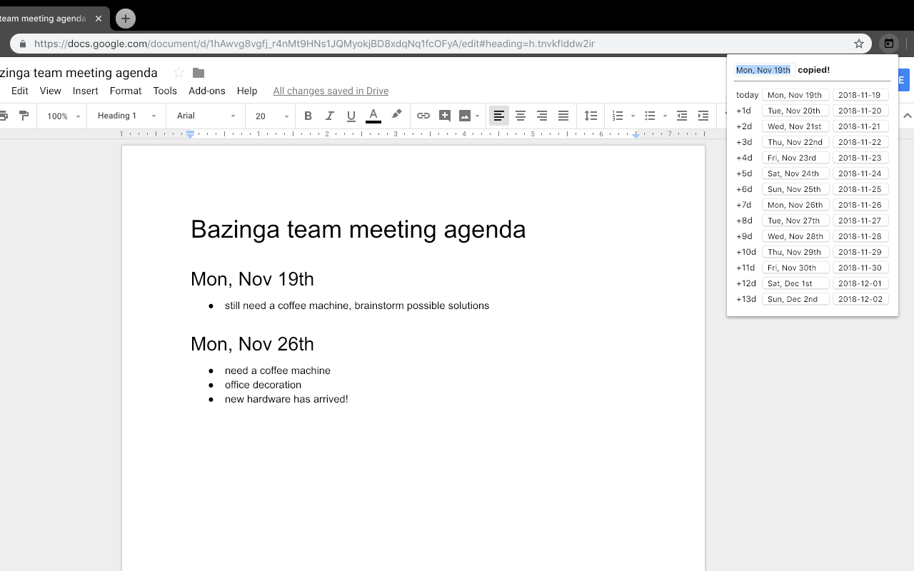

# Near Future

Near Future is a Chrome extension which can display the dates for the next few
days in a human-friendly, inambiguous format in a pop-up window – and allows to
copy them to clipboard in one click.

The extension requires only one permission – writing to clipboard.

See the extension in Chrome Web Store at
https://chrome.google.com/webstore/detail/near-future/meigieddbmonoaildiihpmbcgbkiofmo .
